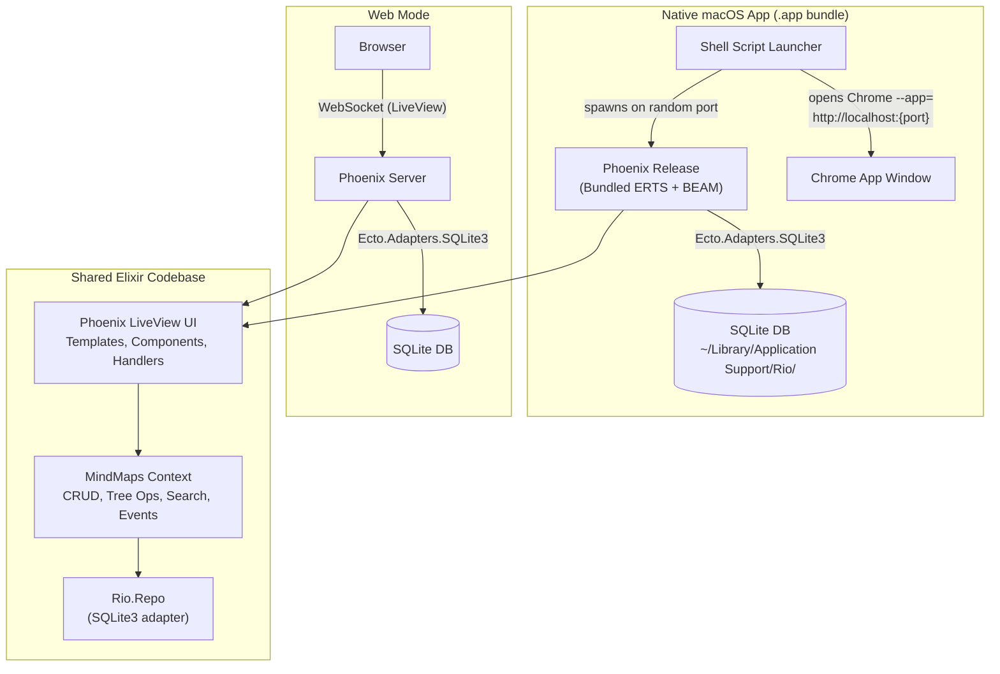

# Rio

A real-time mind mapping application built with Phoenix LiveView and SQLite. Runs as a web app or a native macOS desktop app (Chrome app mode).

## Features

- **Interactive canvas** - Pan, zoom, and navigate your mind maps
- **Keyboard navigation** - Arrow keys to move between nodes
- **Inline editing** - Edit node titles directly on the canvas
- **Todo support** - Mark nodes as tasks with completion tracking
- **Priority levels** - P0-P3 priorities with visual badges
- **Due dates** - Set deadlines with auto-archiving of completed todos
- **Link attachments** - Attach URLs to nodes
- **Full-text search** - FTS5 indexed search with Jaro-Winkler fuzzy matching
- **Context menu** - Right-click for quick actions
- **Undo delete** - Soft delete with batch restore
- **Subtree focus** - Drill down into any branch
- **Theme picker** - Multiple UI themes via DaisyUI
- **Desktop app** - Native macOS app via Chrome app mode (~80MB, no bundled browser)

## Architecture

Rio is a single Phoenix LiveView + SQLite codebase. The native macOS app bundles the Phoenix release in a `.app` and opens Chrome in app mode.



### Key layers

| Layer | What | Key files |
|-------|------|-----------|
| **UI** | LiveView pages, components, handlers | `lib/rio_web/live/` |
| **Context** | Business logic, CRUD, tree operations | `lib/rio/mind_maps/` |
| **Search** | FTS5 full-text search + Jaro-Winkler fuzzy matching | `lib/rio/mind_maps/search.ex`, `lib/rio/fuzzy_search.ex` |
| **Events** | PubSub event tracking | `lib/rio/events/` |
| **Repo** | SQLite3 adapter with materialized paths | `lib/rio/repo.ex`, `lib/rio/ecto/path_type.ex` |
| **Config** | Base config + env-specific overlays | `config/` |

### What differs between web and desktop

| Concern | Web | Desktop |
|---------|-----|---------|
| **Binding** | `127.0.0.1` (dev), configurable (prod) | `127.0.0.1` only |
| **DB location** | Local file (`rio_dev.db`) | `~/Library/Application Support/Rio/` |
| **Shell** | None (browser) | Chrome app mode (standalone window) |
| **Env flag** | Default | `RIO_DESKTOP=true` |

## Project structure

```
rio/
├── lib/
│   ├── rio/                  # Core application
│   │   ├── mind_maps/              # MindMaps context (CRUD, tree, search, layout)
│   │   ├── events/                 # Event pub/sub system
│   │   ├── ecto/                   # Custom Ecto types (PathType)
│   │   ├── repo.ex                 # Ecto repo (SQLite3)
│   │   ├── application.ex          # OTP supervisor, auto-migration
│   │   ├── auto_archiver.ex        # Auto-archive completed todos
│   │   └── fuzzy_search.ex         # Jaro-Winkler fuzzy search
│   └── rio_web/              # Web layer
│       ├── live/                   # LiveView pages & components
│       │   ├── mind_map_live/      # Main mind map view + handler modules
│       │   └── components/         # Reusable UI components
│       ├── router.ex               # Routes
│       └── endpoint.ex             # HTTP endpoint config
├── config/
│   ├── config.exs                  # Base config (shared)
│   ├── dev.exs                     # Dev (SQLite, live reload)
│   ├── prod.exs                    # Production
│   ├── runtime.exs                 # Runtime config (env vars)
│   └── test.exs                    # Test config
├── native/
│   ├── app-bundle/                 # macOS .app bundle template
│   │   ├── launcher                # Shell script (main executable)
│   │   ├── Info.plist              # macOS app metadata
│   │   ├── PkgInfo                 # Package type
│   │   └── icon.icns               # App icon
│   └── scripts/run-phoenix.sh      # Dev mode launcher (legacy)
├── priv/
│   ├── repo/migrations/            # SQLite migrations
│   └── static/                     # Compiled assets, icons, images
├── assets/                         # Frontend source (CSS, JS, vendor)
├── Makefile                        # Build targets (web, desktop-dev, desktop-build)
└── mix.exs                         # Project config, deps, releases
```

## Getting started

### Web

```bash
mix setup
mix phx.server
```

Visit [localhost:4000](http://localhost:4000).

### Desktop (macOS)

**Prerequisites:** Google Chrome

**Dev mode** (starts Phoenix + opens Chrome app window):

```bash
make desktop-dev
```

**Build standalone .app:**

```bash
make desktop-build
```

The built app is at `Rio.app` in the project root.

To install:

```bash
cp -r "Rio.app" /Applications/
```

### Build targets

| Command | Description |
|---------|-------------|
| `make web` | Start Phoenix dev server (SQLite) |
| `make desktop-dev` | Start Phoenix + open Chrome app mode window |
| `make desktop-build` | Build .app bundle (bundles Phoenix release as sidecar) |
| `make desktop-release` | Build just the Phoenix release for desktop |
| `make test` | Run tests |
| `make setup` | Install all dependencies |
| `make clean` | Remove build artifacts |

## Releasing and updating the desktop app

### Data location

The SQLite database lives at `~/Library/Application Support/Rio/rio.db`. This directory is outside the `.app` bundle and is never touched by installs or updates. The app auto-creates it on first launch if it doesn't exist.

Chrome window preferences (size, position) are stored at `~/Library/Application Support/Rio/chrome-profile/`.

To override the data directory: set the `RIO_DATA_DIR` environment variable.

### Building a new release

```bash
# Build the .app bundle (compiles Phoenix release + assembles bundle)
make desktop-build

# Output: Rio.app in project root
```

### Installing / updating

```bash
# Install or update (replaces the app binary, data is preserved)
cp -r "Rio.app" /Applications/
```

### Version bumps

Update the version in these files before building:

- `native/app-bundle/Info.plist` — `CFBundleVersion` (app metadata)
- `mix.exs` — `version` field (Elixir release version)

### Data migration between machines

Export your data to a portable `.wtx` file:

```bash
mix rio.export --output backup.wtx
```

On the new machine:

```bash
mix rio.import backup.wtx --mode full
```

Or simply copy `~/Library/Application Support/Rio/` to the new machine.
